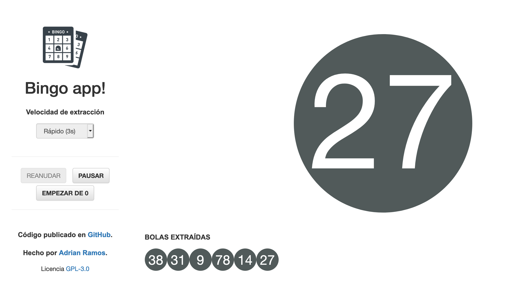

# Bingo app!

EMPIEZA A JUGAR PULSANDO [AQUÍ](https://aramcap.github.io/Bingo-JS/index.html)!

Bingo app! es una aplicación para jugar al bingo en familia o amigos.

Es un simulador de un bombo de bingo, mostrando en pantalla una bola con el número extraído y el listado de bolas extraídas. Podrás seleccionar la velocidad con la que se extraen las bolas y también pausar o reanudar cuando lo necesites.

Para que funcione no necesitas nada más que un navegador de internet y generar unos cartones para ir completando el juego. Los cartones los puedes generar en esta web: http://www.bingo.es/cartones-bingo/

## Cómo funciona por dentro

La tecnología usada es HTML, Javascript y CSS.

## Mejoras futuras

* Responsive
* Poder elegir colores de las bolas

Se aceptan PRs!

## Licencia

Este software se distribuye bajo GNU GPL v3. Puedes leer los términos [aquí](https://github.com/aramcap/Bingo-JS/blob/master/LICENSE).

## Cambios

Este código parte de un fork del repositorio https://github.com/jesusgamero/Bingo-JS. Se ha modificado para que el objeto de funcionamiento se centre en la extracción de bolas del bombo, y únicamente con las tecnologías citadas anteriormente.

## Agradecimientos

Gracias <a href="https://github.com/jesusgamero">Jesús Gamero</a> por el código fuente.

